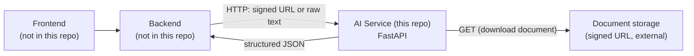
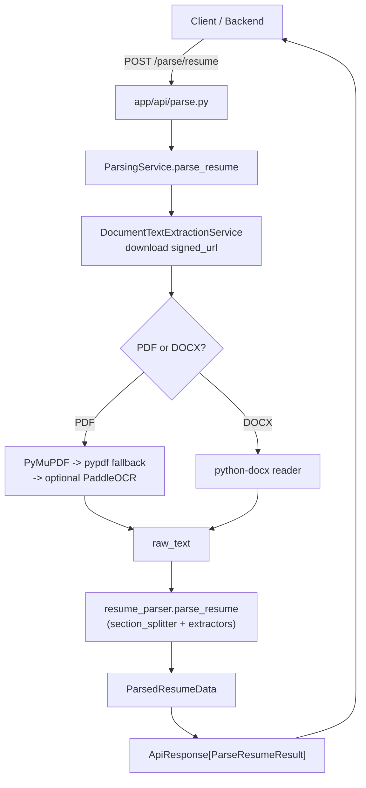
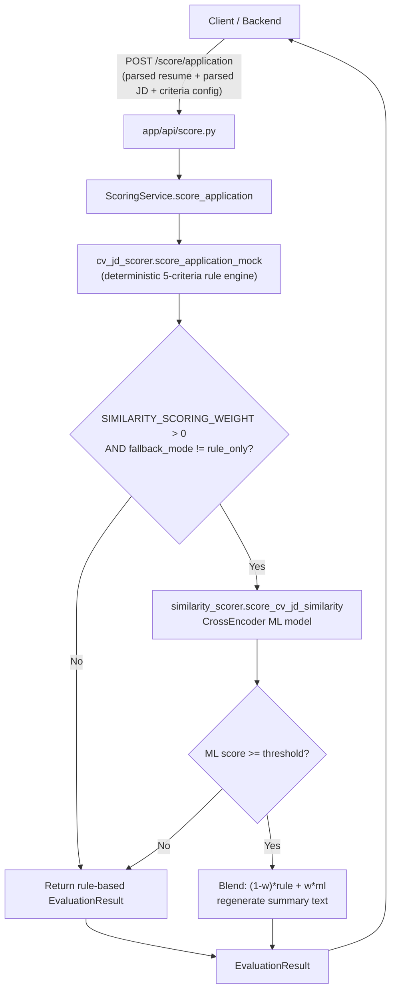
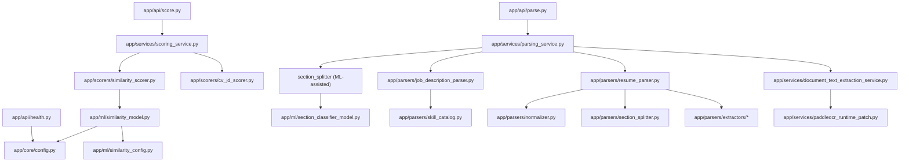

# AI Recruiter Mini — AI Service

---

## Overview

**AI Recruiter Mini AI Service** is a standalone Python microservice that performs resume parsing, job-description parsing, and explainable CV-to-JD scoring for the "AI Recruiter Mini" recruitment platform. It is a **FastAPI** application, invoked internally by a Backend service (not called directly by any Frontend). It downloads resume/JD documents from signed URLs (or accepts raw text), extracts text (with a PDF/OCR fallback pipeline), parses that text into structured JSON with a rule-based extractor pipeline, and scores a parsed resume against a parsed job description using a deterministic, weighted rule engine that can optionally be blended with a fine-tuned CrossEncoder ML model.

The business problem being solved is recruiting screening automation: helping a recruiter/backend quickly turn unstructured resumes and job descriptions into structured, comparable data, and produce an explainable match score (with matched/missing skills and auto-generated interview questions) instead of a black-box number.

Target users, per the service's own documentation, are internal — the Backend of the AI Recruiter Mini platform (a NestJS service, per the AI service contract doc) integrates with this service; end users (recruiters/candidates) never call it directly.

---

## Features

- **Resume Parsing** (`POST /parse/resume`) — turns a PDF/DOCX (via signed URL) or raw pasted text into structured JSON: personal info, summary, skills, education, experience, projects, certifications, achievements, languages.
- **Job Description Parsing** (`POST /parse/job-description`) — turns raw JD text (or a signed-URL document) into structured JSON: title, seniority, employment type, responsibilities, requirements, nice-to-have, required/preferred skills, minimum experience, education requirement, domain keywords.
- **CV–JD Application Scoring** (`POST /score/application`) — scores a parsed resume against a parsed JD using a deterministic 5-criteria weighted rule engine (`SKILLS_MATCH`, `EXPERIENCE_RELEVANCE`, `PROJECT_RELEVANCE`, `EDUCATION_CERTIFICATION`, `KEYWORD_DOMAIN_ALIGNMENT`), optionally blended with a fine-tuned CrossEncoder similarity model.
- **Evidence-based, explainable output** — matched/partial/missing skill classification, per-criterion evidence strings, strong/weak points, a skill-gap summary, and auto-generated interview questions.
- **Multi-layer document text extraction** — PyMuPDF-first, pypdf-fallback PDF extraction, `python-docx` for DOCX, with corrupted-glyph detection (e.g. legacy Vietnamese VNI/TCVN3 font encodings) and an optional local PaddleOCR fallback for scanned/corrupted PDFs.
- **Pluggable ML components** — a CV-JD relevance CrossEncoder, a resume section classifier, and a JD section classifier can each be enabled via environment variables; every one degrades gracefully to a regex/rule-based fallback when disabled, misconfigured, or failing.
- **Model warm-up at startup** — all configured ML models are eagerly loaded during the FastAPI `lifespan` startup hook (not lazily on first request) to avoid a documented production race condition across multi-process Uvicorn workers.
- **Contract-conformant error handling** — validation and HTTP errors are normalized into a single `ApiErrorResponse` shape expected by the Backend.
- **Health check** (`GET /health`) — reports service name, status, version, environment, and configured AI provider.

---

## Architecture Overview

### System Architecture

This repository is the **AI Service** layer only. Per `docs/ai-service-contract.md`, the Frontend never talks to this service directly — it goes through the Backend.



### Request Flow

**Resume parsing (document path):**



**Application scoring:**



### Module Dependency



---

## Technology Stack

| Category | Technology | Notes |
|---|---|---|
| Language | Python 3.12 | `Dockerfile` uses `python:3.12-slim` |
| Web framework | FastAPI 0.136.1 | `app/main.py` |
| ASGI server | Uvicorn 0.46.0 | `scripts/run-local.sh`, `Dockerfile` CMD |
| Validation / settings | Pydantic 2.13.3, pydantic-settings 2.14.0 | `app/schemas/*`, `app/core/config.py` |
| HTTP client | httpx 0.28.1 | Downloading documents from signed URLs |
| PDF extraction | PyMuPDF (`fitz`) `>=1.24.0`, pypdf `>=5.0.0` | `app/services/document_text_extraction_service.py` |
| DOCX extraction | python-docx `>=1.1.2` | Same service |
| OCR (optional) | PaddleOCR 2.8.1, PaddlePaddle 3.2.0 | `requirements-ocr.txt` — **not installed in the Docker image by design**; imported inside try/except and degrades gracefully if absent |
| ML — similarity | sentence-transformers `>=3.0.0,<3.3.0` (`CrossEncoder`) | `app/ml/similarity_model.py`, base model `cross-encoder/ms-marco-MiniLM-L-12-v2` |
| ML — section classification | scikit-learn `>=1.0`, sentence-transformers | `app/ml/section_classifier_model.py`, `app/ml/jd_section_classifier_model.py`, base model `sentence-transformers/all-MiniLM-L6-v2` |
| Testing | pytest 9.0.3 | `tests/`, configured via `pytest.ini` |
| Logging | Python stdlib `logging` | `app/core/logging.py` |
| Containerization | Docker (Debian-based, not Alpine — required for torch/glibc) | `Dockerfile` |
| CI/CD | GitHub Actions | `.github/workflows/docker-publish.yml` |
| Model artifact storage | Git LFS | `.gitattributes` — fine-tuned model weights under `models/` |
| Model registry | GitHub Container Registry (`ghcr.io`) | Image published as `ghcr.io/danghuulong/ai-recruiter-mini-ai-service` |

**Not found in the repository:** frontend framework, database engine/ORM, cache layer, message queue, and authentication/authorization mechanism (the service documents itself as an internal, unauthenticated service reachable only from the Backend network).

---

## Project Structure

```text
.
├── app/                                # FastAPI application
│   ├── main.py                         # App factory, lifespan (ML warm-up), exception handlers
│   ├── api/                            # Route handlers
│   │   ├── health.py                   # GET /health
│   │   ├── parse.py                    # POST /parse/resume, POST /parse/job-description
│   │   └── score.py                    # POST /score/application
│   ├── core/
│   │   ├── config.py                   # Settings (env vars) via pydantic-settings
│   │   └── logging.py                  # logging.basicConfig setup
│   ├── schemas/                        # Pydantic request/response models
│   │   ├── common.py                   # ApiResponse[T], ApiErrorResponse, ErrorItem
│   │   ├── resume.py                   # Resume parsing schemas + GPA regex validator
│   │   ├── job_description.py          # JD parsing schemas
│   │   └── evaluation.py               # Scoring request/response schemas
│   ├── parsers/                        # Rule-based text -> structured-data parsers
│   │   ├── resume_parser.py            # Resume parsing orchestrator
│   │   ├── job_description_parser.py   # JD parsing orchestrator
│   │   ├── pdf_reader.py / docx_reader.py
│   │   ├── section_splitter.py         # Resume section detection (regex + optional ML)
│   │   ├── normalizer.py               # Text cleanup helpers
│   │   ├── skill_catalog.py            # Known-skill dictionary
│   │   ├── normalizers/                # duration_normalizer.py, skill_normalizer.py
│   │   └── extractors/                 # Field-specific extractors (skills, education,
│   │                                    #   experience, projects, achievements,
│   │                                    #   languages, links, email/phone, certifications)
│   ├── services/
│   │   ├── document_text_extraction_service.py  # PDF/DOCX/OCR text extraction pipeline
│   │   ├── parsing_service.py                    # Orchestrates extraction + parsing
│   │   ├── scoring_service.py                    # Orchestrates rule + ML scoring blend
│   │   └── paddleocr_runtime_patch.py            # Runtime patch for PaddleOCR integration
│   ├── scorers/
│   │   ├── cv_jd_scorer.py             # Deterministic 5-criteria rule-based scorer
│   │   └── similarity_scorer.py        # CrossEncoder ML-based similarity scorer
│   ├── ml/                             # Model loaders/config for the 3 optional ML models
│   │   ├── similarity_config.py / similarity_model.py
│   │   ├── section_classifier_config.py / section_classifier_features.py / section_classifier_model.py
│   │   └── jd_section_classifier_config.py / jd_section_classifier_features.py / jd_section_classifier_model.py
│   └── utils/
├── models/                              # Fine-tuned model artifacts (Git LFS)
│   ├── cross-encoder-cv-jd-v0.6/        # CV-JD similarity CrossEncoder weights
│   ├── section-classifier-v0.1/         # Resume section classifier
│   └── jd-section-classifier-v0.1/      # JD section classifier
├── datasets/                            # Training/eval datasets (raw, processed, versioned v0.1–v0.6)
├── training/                            # Dataset validation, splitting, fine-tuning, evaluation scripts
├── notebooks/                           # Colab notebooks for fine-tuning/evaluation experiments
├── scripts/                             # Local dev + data-generation/labeling helper scripts
├── docs/                                # Design docs, contract spec, model documentation
├── samples/                             # Example request/response JSON payloads
├── tests/                               # pytest test suite
├── requirements.txt                     # Core runtime dependencies
├── requirements-ocr.txt                 # Optional local OCR dependencies (not baked into image)
├── Dockerfile                           # Production container image
├── pytest.ini                           # pytest configuration
└── .github/workflows/docker-publish.yml # CI: build & publish image to GHCR on push to main
```

---

## Installation

### Prerequisites

- Python 3.12 (per the Dockerfile base image; `python-dotenv`/pydantic-settings do not enforce a hard minimum in code, but 3.12 is the supported/verified runtime)
- `pip`
- Optional: Docker, for containerized runs
- Optional: a local OCR-capable environment if `ENABLE_PDF_OCR_FALLBACK=true` is desired (see `requirements-ocr.txt`)

### Setup

```bash
git clone https://github.com/DangHuuLong/Ai-Recruiter-Mini-Ai-Service.git
cd Ai-Recruiter-Mini-Ai-Service

python -m venv .venv
source .venv/bin/activate        # Windows: .venv\Scripts\activate

pip install -r requirements.txt

# Optional — only if you need local OCR fallback:
pip install -r requirements-ocr.txt

cp .env.example .env
```

---

## Environment Variables

All variables are defined in `app/core/config.py` (`Settings`, loaded via `pydantic-settings` from a `.env` file) and mirrored in `.env.example`.

| Variable | Purpose | Required | Default / Example |
|---|---|---|---|
| `APP_NAME` | Service name reported by `/health` | No | `ai-recruiter-mini-ai-service` |
| `APP_ENV` | Environment label reported by `/health` | No | `development` |
| `APP_VERSION` | Version string reported by `/health` and FastAPI metadata | No | `0.1.0` |
| `APP_PORT` | Port setting (informational; actual bind port comes from `PORT`, see below) | No | `8000` |
| `LOG_LEVEL` | Python logging level | No | `INFO` |
| `AI_PROVIDER` | Reported in `/health`; not found wired to any external LLM call path in the inspected code | No | `mock` |
| `GEMINI_API_KEY` | Present in settings; **not found** referenced anywhere else in the inspected source | No | *(empty)* |
| `GEMINI_MODEL` | Present in settings; **not found** referenced anywhere else in the inspected source | No | `gemini-3-flash-preview` |
| `REQUEST_TIMEOUT_SECONDS` | Present in settings; the actual document-download timeout in `document_text_extraction_service.py` is hardcoded to 30s | No | `30` |
| `SIMILARITY_MODEL_PATH` | Filesystem path to a fine-tuned CrossEncoder checkpoint for CV-JD similarity | No | *(empty — falls back to `SIMILARITY_BASE_MODEL`)* |
| `SIMILARITY_BASE_MODEL` | HuggingFace CrossEncoder model id used when no fine-tuned path is set | No | `cross-encoder/ms-marco-MiniLM-L-12-v2` |
| `SIMILARITY_MODEL_VERSION` | Free-text version label for the similarity model | No | *(empty)* |
| `SIMILARITY_SCORING_WEIGHT` | Blend weight (0.0–1.0) of ML similarity score into the final `overall_score` | No | `0.0` (ML blending off by default) |
| `SIMILARITY_SCORE_THRESHOLD` | Minimum ML score (0–100) required before it is blended in | No | `0.0` |
| `SIMILARITY_FALLBACK_MODE` | `base_model` or `rule_only` | No | `base_model` |
| `SECTION_CLASSIFIER_MODEL_PATH` | Path to fine-tuned resume section classifier | No | *(empty)* |
| `SECTION_CLASSIFIER_FALLBACK_MODE` | `regex_only` or `model_with_regex_fallback` | No | `regex_only` |
| `JD_SECTION_CLASSIFIER_MODEL_PATH` | Path to fine-tuned JD section classifier | No | *(empty)* |
| `JD_SECTION_CLASSIFIER_FALLBACK_MODE` | `regex_only` or `model_with_regex_fallback` | No | `regex_only` |
| `ENABLE_PDF_OCR_FALLBACK` | Enables local PaddleOCR fallback for scanned/corrupted PDFs | No | `false` |
| `PDF_OCR_ENGINE` | OCR engine identifier | No | `paddleocr` |
| `PDF_OCR_MODE` | `targeted` (header/bottom regions) vs full-page OCR strategy | No | `targeted` |
| `PDF_OCR_LANGUAGES` | `+`-separated language codes tried in order | No | `en+vi` |
| `PDF_OCR_MAX_PAGES` | Max pages OCR will process | No | `2` |
| `PDF_OCR_MIN_CONFIDENCE` | Minimum OCR line confidence accepted | No | `0.5` |
| `PORT` | Actual bind port used by `uvicorn` in the Docker `CMD` | No | `8000` |

---

## Running the Project

### Development

```bash
uvicorn app.main:app --host 0.0.0.0 --port 8000 --reload
```

or, using the provided helper scripts:

```bash
# macOS/Linux
sh scripts/run-local.sh

# Windows PowerShell
./scripts/run-local.ps1
```

The API will be available at `http://localhost:8000`, with interactive docs at `http://localhost:8000/docs` (FastAPI's built-in Swagger UI).

### Production

```bash
uvicorn app.main:app --host 0.0.0.0 --port ${PORT:-8000}
```

### Docker

```bash
docker build -t ai-recruiter-mini-ai-service .
docker run -p 8000:8000 --env-file .env ai-recruiter-mini-ai-service
```

Notes from the `Dockerfile`:
- Base image is `python:3.12-slim` (Debian, **not Alpine** — torch/sentence-transformers require glibc).
- CPU-only `torch` is installed explicitly first to avoid pulling ~2GB of unused CUDA/GPU libraries.
- The base SBERT model (`sentence-transformers/all-MiniLM-L6-v2`) is pre-downloaded into the image at build time so the container never needs network access to Hugging Face Hub at runtime.
- `models/` (fine-tuned weights, tracked via Git LFS) is `COPY`'d into the image; a CI runner doing a fresh clone needs a separate step to fetch these before `docker build` if they aren't already present in the build context.
- A `HEALTHCHECK` hits `GET /health` every 30s.
- The container runs as a non-root `app` user.

### Tests

```bash
pytest
```

(configured via `pytest.ini`: `pythonpath = .`, `testpaths = tests`)

---

## API Overview

Full contract documentation lives in `docs/ai-service-contract.md`. All responses follow a common envelope defined in `app/schemas/common.py`:

```json
{ "success": true, "message": "...", "data": { } }
```

```json
{ "success": false, "message": "...", "errors": [ { "field": "...", "message": "..." } ] }
```

### Health

| Method | Path | Description |
|---|---|---|
| `GET` | `/health` | Returns service name, status, version, environment, and configured `aiProvider`. |

### Parse

| Method | Path | Description |
|---|---|---|
| `POST` | `/parse/resume` | Accepts either `{resume_id, file_name, file_type, signed_url, checksum}` (document) or `{resume_id, raw_text}` (pasted text). Returns `raw_text`, `parsed_data` (`ParsedResumeData`), `parser_version`, `warnings`, `confidence`, `text_extraction_method`. |
| `POST` | `/parse/job-description` | Accepts either `{raw_text}` or `{file_name, file_type, signed_url}`. Returns a `ParsedJobDescriptionData` object. |

### Score

| Method | Path | Description |
|---|---|---|
| `POST` | `/score/application` | Accepts `{resume: ParsedResumeData, job_description: ParsedJobDescriptionData, config: {criteria: [{criterion, weight}, ...]}}`. Returns an `EvaluationResult`: `overall_score`, `summary`, `criteria[]`, `skills[]`, `explanation`, `skill_gap_summary`, `interview_questions[]`, `evidence_map`, `similarity_score`. |

### Validation & error handling

- Request validation errors (`RequestValidationError`) and `HTTPException`s raised in route handlers (e.g. an unsupported document type raising a 422) are both normalized to the `ApiErrorResponse` shape via custom exception handlers registered in `app/main.py`, rather than FastAPI's default `{"detail": [...]}` format.
- `ParseResumeRequest` requires either `signed_url` or `raw_text`; if `signed_url` is given, `file_name` and `file_type` are also required.
- `ParseJobDescriptionRequest` requires either `raw_text` or `signed_url`, with the same `file_name`/`file_type` requirement when `signed_url` is used.

Sample payloads for all three endpoints are provided in `samples/` (`sample_parse_resume_request.json`, `sample_job_description.json`, `sample_score_request.json`, `sample_resume.json`).

**Authentication/authorization:** Not found in the repository — this service has no auth middleware; per its documentation it is intended to be reachable only by the Backend on an internal network.

---

## Database

**Not found in the repository.** This service is stateless — it has no database engine, ORM, schema, or migrations. The "database" of record for parsed/scored results lives in the Backend service (a separate repository referenced in the contract docs), which persists the `EvaluationResult` returned by `/score/application` into its own `Evaluation`, `EvaluationCriterionScore`, `EvaluationSkill`, and related tables.

---

## AI Workflow

The service ships **two independent AI-adjacent pipelines**, both **optional and off by default**, layered over a deterministic rule-based baseline:

### 1. Section classification (assists text parsing)

- **Resume section classifier** (`app/ml/section_classifier_model.py` / `section_classifier_config.py` / `section_classifier_features.py`) — a scikit-learn classifier (`classifier.joblib`) trained to label each line of resume text with a section (summary/skills/experience/etc.), assisting `app/parsers/section_splitter.py`. Controlled by `SECTION_CLASSIFIER_FALLBACK_MODE` (`regex_only` by default; `model_with_regex_fallback` enables the model with a Markov-style `transition_matrix.npy` and falls back to pure regex heuristics if it errors).
- **JD section classifier** (`app/ml/jd_section_classifier_*`) — the same architecture applied to job-description text, assisting `app/parsers/job_description_parser.py`. Controlled by `JD_SECTION_CLASSIFIER_FALLBACK_MODE`.
- Base embedding model for both: `sentence-transformers/all-MiniLM-L6-v2`.

### 2. CV–JD similarity scoring (assists application scoring)

- A `sentence_transformers.CrossEncoder` (pointwise pair scorer, **not** a bi-encoder — the code explicitly warns that a plain embedding model is not compatible despite loading without error) implemented in `app/ml/similarity_model.py`.
- Base model: `cross-encoder/ms-marco-MiniLM-L-12-v2`; a fine-tuned checkpoint (`models/cross-encoder-cv-jd-v0.6/`) can be pointed to via `SIMILARITY_MODEL_PATH`.
- Trained via `training/fine_tune_cross_encoder.py` against `training/prepare_cross_encoder_data.py`-generated pairs (see `notebooks/fine_tune_cross_encoder_v0.*_colab.ipynb`), with labels scaled to `[0, 1]` and an Identity output activation — inference output is clipped to `[0, 1]` and scaled back to a 0–100 score.
- `app/scorers/scoring_service.py` calls the rule-based scorer first (`app/scorers/cv_jd_scorer.py`), then, only if `SIMILARITY_SCORING_WEIGHT > 0` and `SIMILARITY_FALLBACK_MODE != "rule_only"`, computes the ML similarity score and — if it meets `SIMILARITY_SCORE_THRESHOLD` — blends it in as `(1 - w) * rule_score + w * ml_score`, regenerating the human-readable `summary` text so it stays consistent with the blended `overall_score`. Any exception in the ML path is caught and logs a warning, silently returning the rule-only result.

### Model warm-up

All three optional models are eagerly loaded once during FastAPI's `lifespan` startup hook (`_warm_up_ml_models` in `app/main.py`), rather than lazily on first request — this avoids a documented multi-worker race condition where concurrent cold-start requests across separate Uvicorn worker processes could each try to load the same Hugging Face model simultaneously.

### Deterministic rule-based scoring baseline (always active)

`app/scorers/cv_jd_scorer.py` computes 5 weighted criteria — `SKILLS_MATCH` (35%), `EXPERIENCE_RELEVANCE` (30%), `PROJECT_RELEVANCE` (15%), `EDUCATION_CERTIFICATION` (10%), `KEYWORD_DOMAIN_ALIGNMENT` (10%) by default, or a caller-supplied criteria/weight list — using token-overlap heuristics between resume and JD text, stop-word filtering of generic terms, and skill-weight boosts for "core" required skills. It also produces matched/related/missing skill lists, strong/weak points, a skill-gap summary, and up to 6 auto-generated interview questions targeting skill gaps, matched-skill depth, and weak points.

### Document text extraction / normalization pipeline

Not strictly "AI" but feeds all downstream parsing:
- PDF: PyMuPDF (`fitz`) primary extraction with pypdf as a supplemental source, corrupted-glyph detection (including a documented heuristic for legacy Vietnamese VNI/TCVN3 font encodings with no `ToUnicode` map), and an optional local PaddleOCR fallback (targeted header/bottom-region or full-page) when text extraction is missing/poor and `ENABLE_PDF_OCR_FALLBACK=true`.
- DOCX: `python-docx`.
- Output text is sanitized (`ParsingService._sanitize_raw_text`) before being handed to the rule-based extractors.

---

## Deployment

- **Containerization:** `Dockerfile` builds a Debian-based (`python:3.12-slim`) production image running `uvicorn app.main:app` on `$PORT` (default `8000`), as a non-root user, with a built-in `HEALTHCHECK` against `GET /health`.
- **CI/CD:** `.github/workflows/docker-publish.yml` — on every push to the `main` branch, GitHub Actions checks out the repo (with Git LFS enabled, to pull the real fine-tuned model weights instead of LFS pointer files), builds the Docker image with Buildx, and pushes it to **GitHub Container Registry** as `ghcr.io/danghuulong/ai-recruiter-mini-ai-service:latest` and `:<commit-sha>`, using GitHub Actions cache for build layers.
- **Branching model** (documented in the workflow file's comments): `develop` is the integration branch that feature branches merge into; `main` only receives promoted `release/*` branches, so every push to `main` is intended to go live.
- **Kubernetes manifests / other infra-as-code:** Not found in the repository.
- **Model artifact delivery:** Fine-tuned model directories under `models/` are gitignored from plain Git and tracked via **Git LFS** instead (`.gitattributes`); the CI checkout step explicitly enables `lfs: true` so the Docker build has real weights available to `COPY`.

---

## Development Workflow

- **Branching:** `feature/*` branches merge into `develop`; when ready, a `release/*` branch is cut from `develop` and merged into both `main` (triggering the publish pipeline) and back into `develop` (per comments in `.github/workflows/docker-publish.yml`).
- **Testing:** the `tests/` directory (pytest) covers document extraction, error-response contract shape, file readers, health, JD/resume parsing (including ML-assisted paths), parser utilities, resume-layout edge cases, schemas, scoring (baseline and application), section classifiers (resume + JD), and similarity scoring/evaluation. Run with `pytest` (see `pytest.ini`).
- **Model iteration:** the `training/` directory holds scripts for dataset validation (`validate_dataset.py`, `validate_section_dataset.py`, `validate_jd_section_dataset.py`), split planning (`split_dataset.py`), fine-tune readiness checks (`check_fine_tune_readiness.py`), data prep (`prepare_cross_encoder_data.py`, `prepare_section_classifier_data.py`, `prepare_jd_section_classifier_data.py`), fine-tuning (`fine_tune_*.py`), calibration (`calibrate_cross_encoder.py`), and evaluation (`evaluate_*.py`, `eval_compare_cross_encoders.py`, `eval_cross_dataset.py`). See `training/README.md` for the current (Phase 15) scope — it explicitly notes real fine-tuning code was not yet included as of that README's writing, though `fine_tune_*.py` scripts and Colab notebooks do exist in the repo.
- **Dataset versioning:** `datasets/versions/v0.1` through `v0.6` (and a `v0.3`+ `cross_encoder/` subfolder for pairwise train/validation/test splits) track iterative dataset growth; see `docs/dataset-schema.md` and `docs/training-strategy.md`.
- **Labeling tooling:** `scripts/generate_section_labeling_data.py`, `scripts/generate_jd_labeling_data.py`, `scripts/generate_relabel_prompts.py`, `scripts/run_relabeling.py`, `scripts/apply_relabels.py`, and `scripts/llm_client.py` support an LLM-assisted labeling workflow for building classifier training data (see `docs/labeling-guide.md`).
- **Documentation:** `docs/` contains the AI service contract, setup guide, dataset schema, parser/model design docs, and versioned model reports (e.g. `docs/similarity-model-cross-encoder-v0.1.md` through `v0.7.md`).

---

## Troubleshooting

| Symptom | Likely cause / fix |
|---|---|
| `Unsupported document file type` (422) | `file_type`/`file_name` extension isn't `PDF` or `DOCX` — only those two are supported by `DocumentTextExtractionService`. |
| Resume parses with garbled Vietnamese characters | Legacy VNI/TCVN3-encoded PDF with no `ToUnicode` map; enable `ENABLE_PDF_OCR_FALLBACK=true` and ensure `requirements-ocr.txt` is installed so the OCR fallback can recover the text. |
| ML similarity score never affects `overall_score` | `SIMILARITY_SCORING_WEIGHT` defaults to `0.0` (blending disabled) — set it above `0.0` and ensure `SIMILARITY_FALLBACK_MODE != rule_only`. |
| Container starts but a model silently uses **untrained random weights** | Confirmed failure mode noted in the `Dockerfile` comments: if the base SBERT model isn't reachable/cached, sentence-transformers silently creates an untrained encoder instead of erroring. The base model is pre-baked into the Docker image specifically to avoid this — if building your own image, make sure that `RUN python -c "from sentence_transformers import SentenceTransformer; SentenceTransformer(...)"` step is retained. |
| `models/` missing during a fresh `docker build` | Fine-tuned weights are gitignored/LFS-tracked, not plain committed blobs — a CI runner needs `lfs: true` on checkout (already set in the shipped workflow) or a separate fetch-from-storage step before `docker build`. |
| Slow/hanging startup when loading a bare base-model id | Documented Hugging Face Hub freshness-check behavior; `_load_cross_encoder_preferring_cache` / the section-classifier equivalent try `local_files_only=True` first before falling back to a network-allowed load. |

---

## Performance Considerations

- **Eager model warm-up** at process startup (rather than lazy first-request loading) trades slightly slower container start time for eliminating an intermittent multi-worker race condition and avoiding silent 0%-ML-blended responses during a cold-start window (documented in `app/main.py`).
- **CPU-only PyTorch** is deliberately installed in the Docker image (rather than the default CUDA-enabled build pulled in transitively by `sentence-transformers`) to keep the image small, since the service is not designed to run on a GPU.
- **PDF OCR fallback is capped** (`PDF_OCR_MAX_PAGES`, default `2`) and can run in `targeted` mode (header/bottom regions only) instead of full-page OCR, to bound per-request latency.
- **`lru_cache`-based model singletons** (`get_similarity_model`, and equivalents for the section classifiers) avoid reloading models per-request within a worker process.

---

## Security Notes

- **No authentication/authorization layer was found** in this repository — the service is designed to be reached only by the Backend, on a private/internal network, per `docs/ai-service-contract.md`.
- Resume/JD documents are fetched by the AI service from **short-lived signed URLs** supplied by the Backend; this service does not handle upload, storage, or access control for the underlying files itself.
- The Docker image runs the application as a **non-root user** (`app`), created explicitly in the `Dockerfile`.
- `GEMINI_API_KEY` exists as a configuration field but was **not found** to be read or used anywhere else in the inspected source — treat it as reserved/unused rather than an active credential path.
- Dataset validation tooling (`training/validate_dataset.py`) explicitly checks that resume records are anonymized and free of obvious email/phone/personal-profile-URL patterns before being used for training — relevant if extending the training pipeline with real candidate data.

---

## Contributing

No `CONTRIBUTING.md` or explicit contribution guidelines were found in the repository. Based on the CI configuration and branch-naming comments in `.github/workflows/docker-publish.yml`, the implied workflow is:

1. Branch from `develop` using a `feature/*` name.
2. Open a PR back into `develop`.
3. When ready to ship, cut a `release/*` branch from `develop`.
4. Merge the `release/*` branch into `main` (triggers the Docker publish pipeline) and back into `develop`.

Run `pytest` before submitting changes.

---

## License

**Not found in the repository.** No `LICENSE` file was present in the inspected file tree.

---

## Future Improvements

These follow naturally from patterns already present in the codebase:

- Enable the CV-JD CrossEncoder blend by default once a fine-tuned checkpoint clears evaluation thresholds (`SIMILARITY_SCORING_WEIGHT` is currently `0.0` out of the box; the plumbing, calibration script (`training/calibrate_cross_encoder.py`), and versioned model docs already exist).
- Promote the resume/JD section classifiers from `regex_only` to `model_with_regex_fallback` by default, once their evaluation scripts (`training/evaluate_section_classifier.py`, `training/evaluate_jd_section_classifier.py`) show sufficient accuracy over the regex baseline.
- Formalize the currently-unused `AI_PROVIDER` / `GEMINI_API_KEY` / `GEMINI_MODEL` settings into an actual LLM-assisted extraction or scoring path, or remove them if they're vestigial.
- Add authentication between the Backend and this internal service (e.g. a shared secret or mTLS), since none currently exists in code.
- Add a `LICENSE` file and `CONTRIBUTING.md` to formalize contribution and reuse terms.
